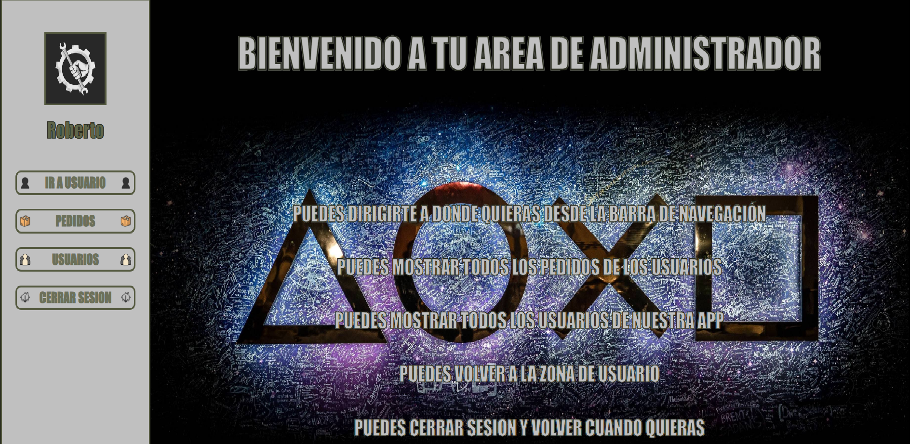

# Proyecto VideoClub Frontend de React.
## Repositorio en el que se a estado trabajando el proyecto. 
## https://github.com/RobertoGuzman64/Proyecto5.git.
***

***
## La aplicación se encuentra desplegada en AWS en el siguiente enlace: https://master.dsuwckp3iftx9.amplifyapp.com/ 
<br>

La aplicación tiene las siguientes características:
* Los usuarios pueden logearse en la aplicación. Existen 2 tipos de usuarios, y cada perfil podrá realizar una serie de acciones:
    * Perfil Usuario:
        * Buscar peliculas por Título.
        * Ver su perfil, Actualizarlo y asi cambiar los datos de nuestra base de datos.
        * Ver los pedidos que ha realizado.
        * Ver todas las peliculas disponibles que tenemos en el videoclub.
    * Perfil Administrador:
        * Puede ver todos los usuarios registados en la app.
        * Puede ver todos los pedidos realizados por todos los usuarios.
***

***

***

## Pre-requisitos del proyecto para hacerlo funcionar en tu equipo local:

* Instalar **Nodejs** en nuestro equipo, descargándolo de su página oficial
https://nodejs.org/

* Clonar el proyecto en nuestro equipo con git bash:
```
$git clone 'url-del-repositorio'
```

* Instalar todas las dependecias con el siguiente comando:
```
npm i
```

* Arrancamos el servidor con el siguiente comando:
```
npm start
```

## Tecnologías utilizadas en el proyecto:

* **react**: Instalamos react en nuestro proyecto:
```
npm i react
```
* **react-router-dom**: Instalamos react-router-dom en nuestro proyecto, para poder alternar entre vistas en nuestra aplicación:
```
npm i react-router-dom
```
* **axios**: Instalamos axios en nuestro proyecto, para poder hacer consultas a la API:
```
npm i axios
```
* **redux**: Instalamos redux en nuestro proyecto, para poder usar redux (centralización del estado):
```
npm i redux
```
* **react-redux**: Instalamos react-redux en nuestro proyecto (relaciona react y redux):
```
npm i react-redux
```
* **react-icons**: Instalamos react-icons en nuestro proyecto (Librería de iconos de react):
```
npm i react-icons
```

## Explicación de la estructura del proyecto

El directorio **src** es donde está almacenada toda la aplicación. En este directorio se encuentra lo siguiente:

* **index.js**: Este es el archivo principal. Desde aquí se llama a **<App/>**, que es donde se ejecutará toda la aplicación.

* **app.js**: En este archivo es donde se gestionan los diferentes **Containers** de la aplicación (vistas).

* **Redux**: En este directorio guardamos toda la configuración de redux de la aplicación.
    * **store.js**: En este archivo se encuentra el estado general de la aplicación.
    * **types.js**: En este archivo se encuentran los nombres de los types que pasamos por action al reducer.
    * **reducers**: En este directorio se encuentran todos los reducers que modifican el estado:
        * **index.js**: En este archivo combinamos todos los reducers, para conseguir la centralización deseada de estados con redux.
        * **datosLogin-reducer.js**: En este archivo tenemos las funciones que editan el estado de redux para los types LOGIN, LOGOUT y MODIFICAR_CREDENCIALES.
        * **busquedaPeliculas-reducer.js**: En este archivo se encuentra la función que edita el estado de redux para el type DETALLE_PELICULA, TITULO_PELICULA, ESTADO_INICIAL Guarda en redux el listado de películas buscado, y también el filtrado que se hace en las barras de búsqueda, y devuelve el estado inicial para hacer otra búsqueda.

* **Containers**: En este directorio es donde se guardarán las diferentes vistas:
    **Containers que usa el Usuario**:
      * **Usuario**: En esta vista tenemos las indicaciones de lo que puede hacer el usuario además de la bienvenida.
      * **Pedidos**: En esta vista se ve el listado de pedidos realizados por ese mismo Usuario.
      * **Buscar**: En esta vista se puede buscar una película por título y además te redirige para poder alquilarla.
      * **Home**: En esta vista tenemos la primera toma de contacto con la aplicación.
      * **Login**: En esta vista tenemos la posibilidad de loguearse o poder redirigir a registro.
      * **Registro**: En esta vista tenemos la posibilidad de introducir los datos para hacer el registro en la app.
      * **Perfil**: En esta vista se muestran los datos del usuario logeado y puede modificar sus datos.
      * **Peliculas**: En esta vista se visualizan todas las películas del videoclub y además te redirige para poder alquilarla.
      * **DetallePelicula**: En esta vista una vez redirigida por Buscar o por Peliculas tenemos el acceso al boton de alquilar cualquier pelicula que hayamos seleccionado previamente.
    **Containers que usa el Administrador**:
      * **Admin**: En esta vista tenemos las indicaciones de lo que puede hacer el administrador además de la bienvenida.
      * **UsuariosAdmin**: En esta vista se visualizan todos usuarios registrados del videoclub.
      * **PedidosAdmin**: En esta vista se visualizan todos pedidos de todos los usuarios del videoclub.
* **Components**: En este directorio es donde se guardan todos los componentes que se usarán en todas las vistas:
    * **LateralUsuario**: Es el menú que aparece en la parte lateral de la aplicación cuando nos logeamos como Usuario.
    * **LateralAdmin**: Es el menú que aparece en la parte lateral de la aplicación cuando nos logeamos como Administrador.
* **img**: En este directorio se guardan todas las imágenes que se usarán para la aplicación y para el readme.